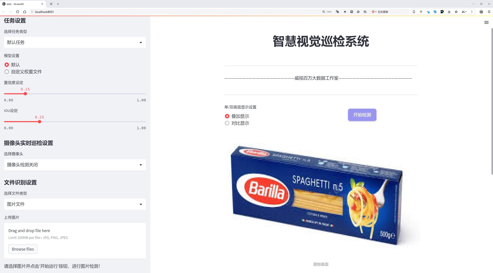
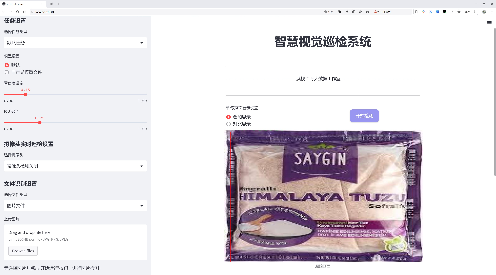
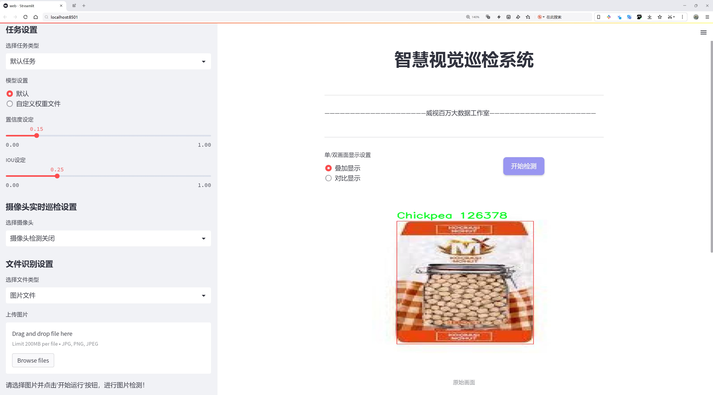
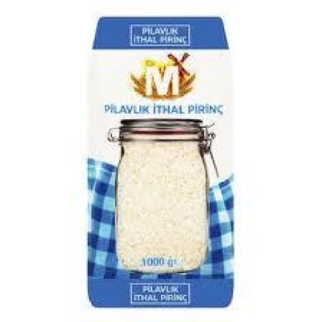
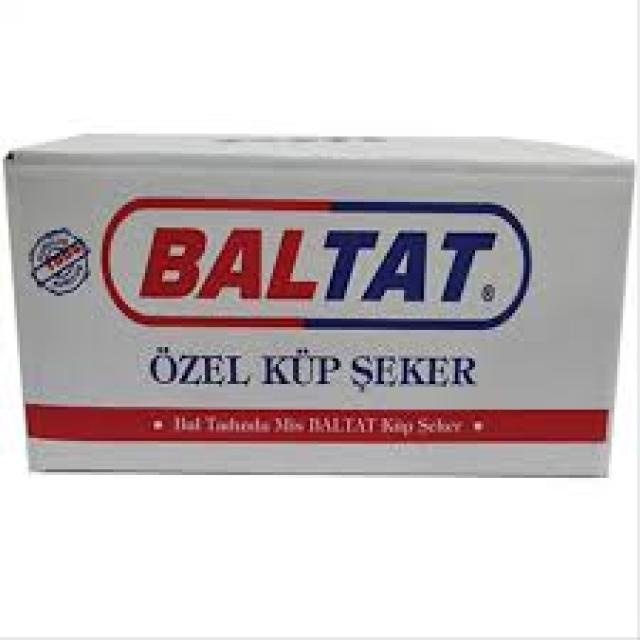
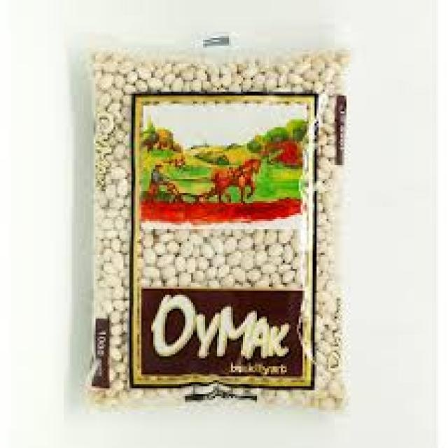

# 食品种类检测系统源码分享
 # [一条龙教学YOLOV8标注好的数据集一键训练_70+全套改进创新点发刊_Web前端展示]

### 1.研究背景与意义

项目参考[AAAI Association for the Advancement of Artificial Intelligence](https://gitee.com/qunmasj/projects)

项目来源[AACV Association for the Advancement of Computer Vision](https://github.com/qunshansj/good)

研究背景与意义

随着全球人口的不断增长和城市化进程的加快，食品安全和营养问题日益受到关注。食品种类的多样性不仅影响着人们的饮食结构，还与健康、经济和环境等多个方面密切相关。在这一背景下，基于计算机视觉技术的食品种类识别系统应运而生，成为解决食品管理、质量监控和消费指导等问题的重要工具。近年来，深度学习技术的快速发展为物体检测领域带来了革命性的变化，其中YOLO（You Only Look Once）系列模型因其高效性和准确性被广泛应用于各类物体检测任务中。

YOLOv8作为YOLO系列的最新版本，具有更高的检测精度和更快的推理速度，能够在复杂环境中实现实时检测。针对食品种类的检测，YOLOv8的改进版本能够有效地处理不同种类食品的图像特征，尤其是在多类食品共存的情况下，能够更准确地识别和分类。这对于食品工业、零售业以及消费者来说，具有重要的现实意义。

本研究旨在基于改进的YOLOv8模型，构建一个针对豆类及其相关产品的食品种类识别系统。所使用的数据集包含2047张图像，涵盖12个类别，包括豆类、粗麦粉、鹰嘴豆、面粉、扁豆、油、意大利面、豌豆、大米、盐、糖和糖块。这些类别不仅代表了丰富的食品种类，还涵盖了人们日常饮食中常见的基础食品。通过对这些食品的自动识别和分类，可以为食品安全监测、营养分析和市场需求预测提供重要的数据支持。

在实际应用中，食品种类识别系统可以帮助商家优化库存管理，提高供应链效率；同时，消费者也可以通过该系统获取更为准确的食品信息，做出更健康的饮食选择。此外，随着人们对健康饮食的重视，食品种类的识别技术还可以为营养师和健康管理者提供有力的工具，帮助他们制定个性化的饮食方案。

综上所述，基于改进YOLOv8的食品种类识别系统不仅具有重要的学术价值，还在实际应用中展现出广泛的前景。通过对豆类及其相关产品的深入研究，能够为推动食品科技的发展、提升食品安全水平、促进健康饮食习惯的形成提供切实的支持。因此，本研究的开展具有重要的理论意义和实践价值，期待能够为食品行业的智能化发展贡献一份力量。

### 2.图片演示







##### 注意：由于此博客编辑较早，上面“2.图片演示”和“3.视频演示”展示的系统图片或者视频可能为老版本，新版本在老版本的基础上升级如下：（实际效果以升级的新版本为准）

  （1）适配了YOLOV8的“目标检测”模型和“实例分割”模型，通过加载相应的权重（.pt）文件即可自适应加载模型。

  （2）支持“图片识别”、“视频识别”、“摄像头实时识别”三种识别模式。

  （3）支持“图片识别”、“视频识别”、“摄像头实时识别”三种识别结果保存导出，解决手动导出（容易卡顿出现爆内存）存在的问题，识别完自动保存结果并导出到tempDir中。

  （4）支持Web前端系统中的标题、背景图等自定义修改，后面提供修改教程。

  另外本项目提供训练的数据集和训练教程,暂不提供权重文件（best.pt）,需要您按照教程进行训练后实现图片演示和Web前端界面演示的效果。

### 3.视频演示

[3.1 视频演示](https://www.bilibili.com/video/BV1FCHGeUEBh/?vd_source=ff015de2d29cbe2a9cdbfa7064407a08)

### 4.数据集信息展示

数据集信息展示

本数据集名为“Pulses”，旨在为改进YOLOv8的食品种类识别系统提供支持。该数据集包含2047张高质量的图像，涵盖了12个不同的食品类别，专注于脉冲类食品的检测与分类。通过精心收集和标注的图像，研究人员和开发者能够有效地训练和优化深度学习模型，以提高食品种类识别的准确性和效率。

在这12个类别中，包含了多种常见的脉冲类食品，如豆类、鹰嘴豆、扁豆等，这些食品在全球范围内被广泛消费，且在不同的文化中扮演着重要的角色。具体类别包括：豆（Bean）、粗麦粉（Bulgur）、鹰嘴豆（Chickpea）、面粉（Flour）、扁豆（Lentil）、油（Oil）、意大利面（Pasta）、豌豆（Peas）、米（Rice）、盐（Salt）、糖（Sugar）和糖块（Sugar Cubes）。这些类别的选择不仅反映了脉冲类食品的多样性，也为模型的训练提供了丰富的样本，使其能够更好地适应不同的应用场景。

数据集中的图像均经过精心挑选，确保其在不同的光照条件、背景和拍摄角度下都能清晰展示目标物体。这种多样性有助于提高模型的鲁棒性，使其在实际应用中能够更好地应对各种复杂情况。此外，数据集遵循CC BY 4.0许可证，允许用户在遵循相关条款的前提下自由使用和修改数据集，这为学术研究和商业应用提供了便利。

在训练YOLOv8模型时，研究人员可以利用该数据集进行多种实验，以探索不同的网络架构、超参数调整和数据增强技术对模型性能的影响。通过对图像进行标注，研究人员能够清晰地定义每个类别的边界框，进而提高模型在目标检测任务中的准确性和召回率。这一过程不仅有助于模型的训练，也为后续的评估和优化提供了重要依据。

总之，“Pulses”数据集为改进YOLOv8的食品种类识别系统提供了丰富的资源，涵盖了多样的脉冲类食品图像，能够有效支持深度学习模型的训练与优化。随着对该数据集的深入研究，预计将推动食品检测技术的发展，提升其在实际应用中的可行性和准确性。通过这一数据集，研究人员和开发者将能够更好地理解和应用深度学习技术，推动食品种类识别领域的创新与进步。









### 5.全套项目环境部署视频教程（零基础手把手教学）

[5.1 环境部署教程链接（零基础手把手教学）](https://www.ixigua.com/7404473917358506534?logTag=c807d0cbc21c0ef59de5)


[5.2 安装Python虚拟环境创建和依赖库安装视频教程链接（零基础手把手教学）](https://www.ixigua.com/7404474678003106304?logTag=1f1041108cd1f708b01a)

### 6.手把手YOLOV8训练视频教程（零基础小白有手就能学会）

[6.1 环境部署教程链接（零基础手把手教学）](https://www.ixigua.com/7404477157818401292?logTag=d31a2dfd1983c9668658)

### 7.70+种全套YOLOV8创新点代码加载调参视频教程（一键加载写好的改进模型的配置文件）

[7.1 环境部署教程链接（零基础手把手教学）](https://www.ixigua.com/7404478314661806627?logTag=29066f8288e3f4eea3a4)

### 8.70+种全套YOLOV8创新点原理讲解（非科班也可以轻松写刊发刊，V10版本正在科研待更新）

由于篇幅限制，每个创新点的具体原理讲解就不一一展开，具体见下列网址中的创新点对应子项目的技术原理博客网址【Blog】：


[8.1 70+种全套YOLOV8创新点原理讲解链接](https://gitee.com/qunmasj/good)

### 9.系统功能展示（检测对象为举例，实际内容以本项目数据集为准）

图9.1.系统支持检测结果表格显示

  图9.2.系统支持置信度和IOU阈值手动调节

  图9.3.系统支持自定义加载权重文件best.pt(需要你通过步骤5中训练获得)

  图9.4.系统支持摄像头实时识别

  图9.5.系统支持图片识别

  图9.6.系统支持视频识别

  图9.7.系统支持识别结果文件自动保存

  图9.8.系统支持Excel导出检测结果数据


### 10.原始YOLOV8算法原理

原始YOLOv8算法原理

YOLOv8算法作为目标检测领域的最新代表，继承并发展了YOLO系列的核心思想，以其高效性和准确性在众多算法中脱颖而出。其设计理念旨在通过优化网络结构和改进损失函数，使得目标检测不仅在速度上具备优势，同时在精度上也能达到更高的水平。YOLOv8的核心构架分为输入端、骨干网络、颈部网络和头部网络四个主要部分，每个部分都经过精心设计，以确保整体性能的提升。

在输入端，YOLOv8采用了马赛克数据增强技术，这一方法通过将多张图像拼接在一起，生成新的训练样本，增强了模型的泛化能力。此外，自适应锚框计算和自适应灰度填充的引入，使得模型能够更好地适应不同的输入数据，从而提高了目标检测的准确性和鲁棒性。

骨干网络部分，YOLOv8引入了CSPDarknet结构，并将传统的C3模块替换为C2f模块。这一改进使得网络能够更有效地学习特征。C2f模块通过将输入特征图分为两个分支，各自经过卷积层进行处理，再通过融合层合并输出，形成更丰富的特征表示。这种设计不仅提升了梯度流的传递效率，还增强了特征的表达能力，使得模型在面对复杂场景时能够更好地识别目标。

颈部网络则采用了路径聚合网络（PAN）结构，这一结构通过加强不同尺度特征的融合能力，确保了模型在处理多尺度目标时的表现。PAN通过连接不同层次的特征图，使得低层次的细节信息与高层次的语义信息能够有效结合，从而提升了目标检测的精度。

在头部网络方面，YOLOv8进行了重要的结构调整，将分类和检测过程解耦。这一设计使得模型在处理目标检测时能够更加灵活高效。头部网络中的损失计算采用了Task-Aligned Assigner策略，通过加权的方式选择正样本，从而提高了样本的利用率。分类分支使用了二元交叉熵损失，而回归分支则结合了分布焦点损失和完全交并比损失，这种多元化的损失计算方式显著提升了模型对边界框的预测精度。

YOLOv8在目标检测过程中还引入了无锚框（Anchor-Free）检测机制，直接预测目标的中心点和宽高比例。这一方法减少了对锚框的依赖，降低了计算复杂度，同时加速了非最大抑制（NMS）过程，使得模型在实时检测中表现更加出色。通过这一系列的优化，YOLOv8不仅在速度上达到了实时检测的要求，更在准确性上取得了显著的提升。

值得一提的是，YOLOv8在设计过程中充分考虑了不同应用场景的需求，提供了多种模型版本，如YOLOv8n、YOLOv8s、YOLOv8m、YOLOv8l和YOLOv8x，用户可以根据具体需求选择合适的模型。这种灵活性使得YOLOv8能够广泛应用于智能监控、自动驾驶、无人机等多个领域。

总的来说，YOLOv8算法通过一系列的结构优化和损失函数改进，成功实现了高效、准确的目标检测。其在特征提取、特征融合和目标检测等多个环节的创新设计，使得YOLOv8在目标检测领域树立了新的标杆。未来，随着技术的不断进步，YOLOv8有望在更多复杂场景中发挥其强大的能力，为智能视觉系统的发展提供更为坚实的基础。


### 11.项目核心源码讲解（再也不用担心看不懂代码逻辑）

#### 11.1 ultralytics\data\utils.py

以下是经过精简和注释的核心代码部分，主要集中在数据集的验证和处理功能上：

```python
import os
import hashlib
import numpy as np
from PIL import Image, ImageOps
from ultralytics.utils import check_class_names, yaml_load, yaml_save

IMG_FORMATS = ("bmp", "jpeg", "jpg", "png", "tif", "tiff")  # 支持的图像格式

def img2label_paths(img_paths):
    """根据图像路径生成标签路径"""
    sa, sb = f"{os.sep}images{os.sep}", f"{os.sep}labels{os.sep}"  # 图像和标签的目录名
    return [sb.join(x.rsplit(sa, 1)).rsplit(".", 1)[0] + ".txt" for x in img_paths]

def exif_size(img: Image.Image):
    """返回经过EXIF校正的图像大小"""
    s = img.size  # 获取图像的宽和高
    if img.format == "JPEG":  # 仅支持JPEG格式
        exif = img.getexif()  # 获取EXIF信息
        if exif:
            rotation = exif.get(274, None)  # 获取方向信息
            if rotation in [6, 8]:  # 旋转270或90度
                s = s[1], s[0]  # 交换宽高
    return s

def verify_image(im_file):
    """验证单个图像的完整性"""
    nf, nc, msg = 0, 0, ""
    try:
        im = Image.open(im_file)  # 打开图像
        im.verify()  # 验证图像
        shape = exif_size(im)  # 获取图像大小
        assert (shape[0] > 9) & (shape[1] > 9), f"图像大小 {shape} <10 像素"
        assert im.format.lower() in IMG_FORMATS, f"无效的图像格式 {im.format}"
        nf = 1  # 图像有效
    except Exception as e:
        nc = 1  # 图像损坏
        msg = f"警告 ⚠️ {im_file}: 忽略损坏的图像: {e}"
    return im_file, nf, nc, msg

def verify_image_label(im_file, lb_file):
    """验证图像和标签的配对"""
    nf, nc, msg = 0, 0, ""
    try:
        # 验证图像
        im = Image.open(im_file)
        im.verify()
        shape = exif_size(im)
        assert (shape[0] > 9) & (shape[1] > 9), f"图像大小 {shape} <10 像素"
        
        # 验证标签
        if os.path.isfile(lb_file):
            nf = 1  # 标签存在
            with open(lb_file) as f:
                lb = [x.split() for x in f.read().strip().splitlines() if len(x)]
                lb = np.array(lb, dtype=np.float32)  # 转换为浮点数组
            nl = len(lb)
            if nl:
                assert lb.shape[1] == 5, f"标签需要5列, 检测到 {lb.shape[1]} 列"
                points = lb[:, 1:]  # 获取坐标点
                assert points.max() <= 1, f"坐标超出范围 {points[points > 1]}"
                assert lb.min() >= 0, f"标签值为负 {lb[lb < 0]}"
        else:
            msg = f"警告 ⚠️ {im_file}: 标签缺失"
            nc = 1  # 标签缺失
    except Exception as e:
        nc = 1
        msg = f"警告 ⚠️ {im_file}: 忽略损坏的图像/标签: {e}"
    return im_file, nf, shape, msg

def check_det_dataset(dataset):
    """检查检测数据集的完整性"""
    # 读取YAML文件并进行必要的检查
    data = yaml_load(dataset)  # 加载YAML文件
    for k in ["train", "val"]:
        if k not in data:
            raise SyntaxError(f"{dataset} '{k}:' 键缺失 ❌. 'train' 和 'val' 是所有数据YAML中必需的.")
    if "names" not in data and "nc" not in data:
        raise SyntaxError(f"{dataset} 键缺失 ❌. 'names' 或 'nc' 是所有数据YAML中必需的.")
    return data  # 返回数据集信息

# 示例用法
# dataset_info = check_det_dataset('path/to/dataset.yaml')
# img_file, label_file = 'path/to/image.jpg', 'path/to/label.txt'
# verify_image(img_file)
# verify_image_label(img_file, label_file)
```

### 代码说明：
1. **图像和标签路径处理**：`img2label_paths` 函数根据图像路径生成对应的标签路径。
2. **图像大小校正**：`exif_size` 函数通过EXIF信息校正图像的宽高，主要针对JPEG格式。
3. **图像验证**：`verify_image` 函数用于验证单个图像的完整性，检查其格式和大小。
4. **图像和标签配对验证**：`verify_image_label` 函数验证图像和其对应标签的完整性，确保标签文件存在且格式正确。
5. **数据集检查**：`check_det_dataset` 函数用于检查检测数据集的完整性，确保YAML文件中包含必要的键。

这些核心功能是处理和验证数据集的基础，确保数据的完整性和有效性。

该文件是Ultralytics YOLO项目中的一个工具模块，主要用于处理数据集的相关操作，包括图像和标签的验证、数据集的下载和检查、图像格式的转换等。以下是对文件中各个部分的详细说明。

首先，文件导入了一系列必要的库，包括标准库和第三方库。标准库提供了文件操作、哈希计算、时间处理等功能，而第三方库如OpenCV和PIL则用于图像处理。Ultralytics项目中的一些工具函数和常量也被导入，以便在后续的操作中使用。

接下来，定义了一些常量，例如支持的图像和视频格式，以及一个全局变量`PIN_MEMORY`，用于控制数据加载器的内存管理。

文件中包含多个函数，首先是`img2label_paths`，该函数根据图像路径生成对应的标签路径。`get_hash`函数则用于计算给定路径列表的哈希值，以便在后续操作中验证文件的完整性。

`exif_size`函数用于获取经过EXIF校正的图像尺寸，主要针对JPEG格式的图像。`verify_image`和`verify_image_label`函数分别用于验证单张图像和图像-标签对的有效性，包括检查图像格式、尺寸、损坏情况等，并返回相应的验证结果。

`polygon2mask`和`polygons2masks`函数用于将多边形转换为二进制掩码，支持图像分割任务。`find_dataset_yaml`函数用于查找与数据集相关的YAML文件，确保数据集格式正确。

`check_det_dataset`和`check_cls_dataset`函数用于检查检测和分类数据集的有效性，支持自动下载缺失的数据集。它们会解析YAML文件，验证数据集的结构和内容，并确保数据集的路径正确。

`HUBDatasetStats`类用于生成HUB数据集的统计信息，包括处理图像、生成JSON文件等。它会在初始化时检查数据集的有效性，并提供方法来获取和保存统计信息。

最后，`compress_one_image`函数用于压缩单张图像，保持其纵横比和质量。`autosplit`函数则用于自动将数据集划分为训练、验证和测试集，并将结果保存到文本文件中。

总体而言，该文件为YOLO项目提供了丰富的数据处理功能，确保数据集的完整性和有效性，为后续的模型训练和评估奠定了基础。

#### 11.2 ui.py

```python
import sys
import subprocess

def run_script(script_path):
    """
    使用当前 Python 环境运行指定的脚本。

    Args:
        script_path (str): 要运行的脚本路径

    Returns:
        None
    """
    # 获取当前 Python 解释器的路径
    python_path = sys.executable

    # 构建运行命令
    command = f'"{python_path}" -m streamlit run "{script_path}"'

    # 执行命令
    result = subprocess.run(command, shell=True)
    if result.returncode != 0:
        print("脚本运行出错。")


# 实例化并运行应用
if __name__ == "__main__":
    # 指定您的脚本路径
    script_path = "web.py"  # 这里可以直接指定脚本名称

    # 运行脚本
    run_script(script_path)
```

### 代码注释

1. **导入模块**：
   - `import sys`：导入 `sys` 模块，用于访问与 Python 解释器相关的变量和函数。
   - `import subprocess`：导入 `subprocess` 模块，用于创建新进程、连接到它们的输入/输出/错误管道，并获取返回码。

2. **定义函数 `run_script`**：
   - 该函数接受一个参数 `script_path`，表示要运行的 Python 脚本的路径。

3. **获取当前 Python 解释器的路径**：
   - `python_path = sys.executable`：获取当前正在使用的 Python 解释器的完整路径。

4. **构建运行命令**：
   - `command = f'"{python_path}" -m streamlit run "{script_path}"'`：构建一个命令字符串，用于运行指定的脚本。这里使用了 `streamlit` 模块来运行 Python 脚本。

5. **执行命令**：
   - `result = subprocess.run(command, shell=True)`：使用 `subprocess.run` 执行构建的命令。`shell=True` 允许在 shell 中执行命令。

6. **检查命令执行结果**：
   - `if result.returncode != 0:`：检查命令的返回码，如果不为 0，表示执行过程中出现错误。
   - `print("脚本运行出错。")`：如果出现错误，输出提示信息。

7. **主程序入口**：
   - `if __name__ == "__main__":`：确保只有在直接运行该脚本时才会执行以下代码。
   - `script_path = "web.py"`：指定要运行的脚本名称。
   - `run_script(script_path)`：调用 `run_script` 函数，传入脚本路径以执行该脚本。

这个程序文件名为 `ui.py`，主要功能是使用当前的 Python 环境来运行一个指定的脚本。代码中首先导入了必要的模块，包括 `sys`、`os` 和 `subprocess`，以及一个自定义的模块 `QtFusion.path` 中的 `abs_path` 函数。

在 `run_script` 函数中，首先获取当前 Python 解释器的路径，这样可以确保使用正确的 Python 环境来执行脚本。接着，构建一个命令字符串，该命令使用 `streamlit` 模块来运行指定的脚本。`streamlit` 是一个用于构建数据应用的库，命令的格式为 `python -m streamlit run script_path`。

然后，使用 `subprocess.run` 方法来执行这个命令。该方法会在一个新的 shell 中运行命令，并返回一个结果对象。通过检查 `result.returncode`，可以判断脚本是否成功运行。如果返回码不为零，表示运行过程中出现了错误，此时会打印出“脚本运行出错”的提示信息。

在文件的最后部分，使用 `if __name__ == "__main__":` 语句来确保只有在直接运行该脚本时才会执行后面的代码。在这里，指定了要运行的脚本路径为 `web.py`，并调用 `run_script` 函数来执行这个脚本。为了确保路径的正确性，使用了 `abs_path` 函数来获取 `web.py` 的绝对路径。

总体来说，这个程序的主要目的是提供一个简单的接口来运行 `web.py` 脚本，利用 `streamlit` 库创建一个数据应用。

#### 11.3 ultralytics\models\sam\modules\decoders.py

以下是经过简化并添加详细中文注释的核心代码部分：

```python
import torch
from torch import nn
from torch.nn import functional as F
from ultralytics.nn.modules import LayerNorm2d

class MaskDecoder(nn.Module):
    """
    MaskDecoder类用于生成掩码及其质量评分，采用变换器架构根据图像和提示嵌入预测掩码。
    """

    def __init__(self, transformer_dim: int, transformer: nn.Module, num_multimask_outputs: int = 3, activation: Type[nn.Module] = nn.GELU, iou_head_depth: int = 3, iou_head_hidden_dim: int = 256) -> None:
        """
        初始化MaskDecoder类。

        参数:
            transformer_dim (int): 变换器模块的通道维度
            transformer (nn.Module): 用于预测掩码的变换器
            num_multimask_outputs (int): 预测的掩码数量
            activation (nn.Module): 上采样时使用的激活函数类型
            iou_head_depth (int): 用于预测掩码质量的MLP深度
            iou_head_hidden_dim (int): 用于预测掩码质量的MLP隐藏维度
        """
        super().__init__()
        self.transformer_dim = transformer_dim  # 变换器的通道维度
        self.transformer = transformer  # 变换器模块

        self.num_multimask_outputs = num_multimask_outputs  # 多掩码输出数量

        # IoU token的嵌入
        self.iou_token = nn.Embedding(1, transformer_dim)
        self.num_mask_tokens = num_multimask_outputs + 1  # 掩码token数量
        self.mask_tokens = nn.Embedding(self.num_mask_tokens, transformer_dim)  # 掩码token的嵌入

        # 输出上采样网络
        self.output_upscaling = nn.Sequential(
            nn.ConvTranspose2d(transformer_dim, transformer_dim // 4, kernel_size=2, stride=2),
            LayerNorm2d(transformer_dim // 4),
            activation(),
            nn.ConvTranspose2d(transformer_dim // 4, transformer_dim // 8, kernel_size=2, stride=2),
            activation(),
        )

        # 用于生成掩码的超网络MLP
        self.output_hypernetworks_mlps = nn.ModuleList(
            [MLP(transformer_dim, transformer_dim, transformer_dim // 8, 3) for _ in range(self.num_mask_tokens)]
        )

        # 预测掩码质量的MLP
        self.iou_prediction_head = MLP(transformer_dim, iou_head_hidden_dim, self.num_mask_tokens, iou_head_depth)

    def forward(self, image_embeddings: torch.Tensor, image_pe: torch.Tensor, sparse_prompt_embeddings: torch.Tensor, dense_prompt_embeddings: torch.Tensor, multimask_output: bool) -> Tuple[torch.Tensor, torch.Tensor]:
        """
        根据图像和提示嵌入预测掩码。

        参数:
            image_embeddings (torch.Tensor): 图像编码器的嵌入
            image_pe (torch.Tensor): 图像嵌入的位置信息
            sparse_prompt_embeddings (torch.Tensor): 稀疏提示的嵌入
            dense_prompt_embeddings (torch.Tensor): 密集提示的嵌入
            multimask_output (bool): 是否返回多个掩码

        返回:
            torch.Tensor: 预测的掩码
            torch.Tensor: 掩码质量的预测
        """
        # 预测掩码和IoU
        masks, iou_pred = self.predict_masks(image_embeddings, image_pe, sparse_prompt_embeddings, dense_prompt_embeddings)

        # 根据multimask_output选择输出的掩码
        mask_slice = slice(1, None) if multimask_output else slice(0, 1)
        masks = masks[:, mask_slice, :, :]
        iou_pred = iou_pred[:, mask_slice]

        return masks, iou_pred  # 返回掩码和IoU预测

    def predict_masks(self, image_embeddings: torch.Tensor, image_pe: torch.Tensor, sparse_prompt_embeddings: torch.Tensor, dense_prompt_embeddings: torch.Tensor) -> Tuple[torch.Tensor, torch.Tensor]:
        """
        预测掩码。

        参数:
            image_embeddings (torch.Tensor): 图像编码器的嵌入
            image_pe (torch.Tensor): 图像嵌入的位置信息
            sparse_prompt_embeddings (torch.Tensor): 稀疏提示的嵌入
            dense_prompt_embeddings (torch.Tensor): 密集提示的嵌入

        返回:
            torch.Tensor: 预测的掩码
            torch.Tensor: 掩码质量的预测
        """
        # 连接输出token
        output_tokens = torch.cat([self.iou_token.weight, self.mask_tokens.weight], dim=0)
        output_tokens = output_tokens.unsqueeze(0).expand(sparse_prompt_embeddings.size(0), -1, -1)
        tokens = torch.cat((output_tokens, sparse_prompt_embeddings), dim=1)

        # 扩展每个图像的数据以适应每个掩码
        src = torch.repeat_interleave(image_embeddings, tokens.shape[0], dim=0)
        src = src + dense_prompt_embeddings
        pos_src = torch.repeat_interleave(image_pe, tokens.shape[0], dim=0)

        # 运行变换器
        hs, src = self.transformer(src, pos_src, tokens)
        iou_token_out = hs[:, 0, :]  # IoU token的输出
        mask_tokens_out = hs[:, 1 : (1 + self.num_mask_tokens), :]  # 掩码token的输出

        # 上采样掩码嵌入并使用掩码token预测掩码
        src = src.transpose(1, 2).view(src.shape[0], src.shape[1], -1)
        upscaled_embedding = self.output_upscaling(src)
        hyper_in_list: List[torch.Tensor] = [
            self.output_hypernetworks_mlps[i](mask_tokens_out[:, i, :]) for i in range(self.num_mask_tokens)
        ]
        hyper_in = torch.stack(hyper_in_list, dim=1)
        masks = (hyper_in @ upscaled_embedding.view(upscaled_embedding.shape[0], upscaled_embedding.shape[1], -1)).view(upscaled_embedding.shape[0], -1, upscaled_embedding.shape[2], upscaled_embedding.shape[3])

        # 生成掩码质量预测
        iou_pred = self.iou_prediction_head(iou_token_out)

        return masks, iou_pred  # 返回掩码和IoU预测


class MLP(nn.Module):
    """
    MLP（多层感知器）模型，轻微改编自MaskFormer。
    """

    def __init__(self, input_dim: int, hidden_dim: int, output_dim: int, num_layers: int, sigmoid_output: bool = False) -> None:
        """
        初始化MLP模型。

        参数:
            input_dim (int): 输入特征的维度
            hidden_dim (int): 隐藏层的维度
            output_dim (int): 输出层的维度
            num_layers (int): 隐藏层的数量
            sigmoid_output (bool, optional): 是否对输出层应用sigmoid激活。默认为False。
        """
        super().__init__()
        self.num_layers = num_layers
        h = [hidden_dim] * (num_layers - 1)  # 隐藏层维度列表
        self.layers = nn.ModuleList(nn.Linear(n, k) for n, k in zip([input_dim] + h, h + [output_dim]))  # 创建线性层
        self.sigmoid_output = sigmoid_output  # 是否使用sigmoid激活

    def forward(self, x):
        """执行前向传播并应用激活函数。"""
        for i, layer in enumerate(self.layers):
            x = F.relu(layer(x)) if i < self.num_layers - 1 else layer(x)  # 对隐藏层应用ReLU激活
        if self.sigmoid_output:
            x = torch.sigmoid(x)  # 对输出层应用sigmoid激活
        return x  # 返回输出
```

### 代码说明：
1. **MaskDecoder类**：用于根据图像和提示嵌入生成掩码和质量评分，采用变换器架构。
   - **初始化方法**：设置变换器的维度、模块、掩码数量等。
   - **forward方法**：接收图像和提示嵌入，预测掩码和质量评分。
   - **predict_masks方法**：实现掩码的具体预测逻辑，包括连接token、运行变换器和上采样等步骤。

2. **MLP类**：实现多层感知器，用于掩码质量预测。
   - **初始化方法**：设置输入、隐藏和输出维度，构建线性层。
   - **forward方法**：执行前向传播并应用激活函数。

这段代码是一个深度学习模型的一部分，主要用于图像分割任务中的掩码生成。

这个程序文件定义了一个名为 `MaskDecoder` 的类，属于 PyTorch 的 `nn.Module` 模块，主要用于生成图像的掩码及其质量评分。该类使用了变换器（transformer）架构，通过图像和提示嵌入（prompt embeddings）来预测掩码。

在 `MaskDecoder` 类的构造函数中，初始化了一些重要的属性，包括变换器的维度、变换器模块本身、需要预测的掩码数量、IoU（Intersection over Union）标记的嵌入、掩码标记的嵌入以及输出上采样的神经网络序列。输出上采样的部分使用了转置卷积层和层归一化，并结合激活函数（默认为 GELU）来增强模型的表达能力。此外，还定义了用于生成掩码的超网络 MLP（多层感知器）和用于预测掩码质量的 MLP。

`forward` 方法是该类的核心，接收图像嵌入、位置编码、稀疏和密集的提示嵌入以及一个布尔值（指示是否返回多个掩码）。它首先调用 `predict_masks` 方法来生成掩码和 IoU 预测，然后根据 `multimask_output` 的值选择输出相应的掩码和质量预测。

`predict_masks` 方法负责实际的掩码预测。它首先将 IoU 标记和掩码标记的嵌入进行拼接，并扩展到每个图像的批次。接着，将图像嵌入和密集提示嵌入结合，形成输入源。然后通过变换器进行处理，得到 IoU 标记和掩码标记的输出。接下来，掩码嵌入会经过上采样处理，并通过超网络 MLP 生成最终的掩码。最后，使用 IoU 标记输出掩码质量的预测。

此外，文件中还定义了一个 `MLP` 类，用于构建多层感知器。该类的构造函数接收输入维度、隐藏层维度、输出维度和层数，并创建相应的线性层。`forward` 方法则执行前向传播，并在最后一层应用激活函数（如果需要的话）。

整体来看，这个程序文件实现了一个基于变换器的掩码解码器，能够处理图像和提示信息，生成高质量的掩码及其对应的质量评分，适用于图像分割等任务。

#### 11.4 ultralytics\models\yolo\segment\train.py

以下是代码中最核心的部分，并附上详细的中文注释：

```python
from ultralytics.models import yolo
from ultralytics.nn.tasks import SegmentationModel
from ultralytics.utils import DEFAULT_CFG, RANK
from ultralytics.utils.plotting import plot_images, plot_results

class SegmentationTrainer(yolo.detect.DetectionTrainer):
    """
    扩展DetectionTrainer类，用于基于分割模型的训练。
    """

    def __init__(self, cfg=DEFAULT_CFG, overrides=None, _callbacks=None):
        """初始化SegmentationTrainer对象，接受配置和覆盖参数。"""
        if overrides is None:
            overrides = {}
        overrides["task"] = "segment"  # 设置任务类型为分割
        super().__init__(cfg, overrides, _callbacks)  # 调用父类的初始化方法

    def get_model(self, cfg=None, weights=None, verbose=True):
        """返回初始化的SegmentationModel模型，使用指定的配置和权重。"""
        model = SegmentationModel(cfg, ch=3, nc=self.data["nc"], verbose=verbose and RANK == -1)
        if weights:
            model.load(weights)  # 如果提供了权重，则加载权重

        return model  # 返回模型

    def get_validator(self):
        """返回SegmentationValidator实例，用于YOLO模型的验证。"""
        self.loss_names = "box_loss", "seg_loss", "cls_loss", "dfl_loss"  # 定义损失名称
        return yolo.segment.SegmentationValidator(
            self.test_loader, save_dir=self.save_dir, args=copy(self.args), _callbacks=self.callbacks
        )  # 返回验证器实例

    def plot_training_samples(self, batch, ni):
        """创建训练样本图像的绘图，包含标签和框坐标。"""
        plot_images(
            batch["img"],  # 图像数据
            batch["batch_idx"],  # 批次索引
            batch["cls"].squeeze(-1),  # 类别标签
            batch["bboxes"],  # 边界框
            masks=batch["masks"],  # 分割掩码
            paths=batch["im_file"],  # 图像文件路径
            fname=self.save_dir / f"train_batch{ni}.jpg",  # 保存文件名
            on_plot=self.on_plot,  # 绘图回调
        )

    def plot_metrics(self):
        """绘制训练和验证指标。"""
        plot_results(file=self.csv, segment=True, on_plot=self.on_plot)  # 保存结果图像
```

### 代码说明：
1. **导入模块**：导入必要的模块和类，包括YOLO模型、分割模型、默认配置、绘图工具等。
2. **SegmentationTrainer类**：该类继承自`DetectionTrainer`，用于处理分割任务的训练。
3. **初始化方法**：在初始化时设置任务类型为分割，并调用父类的初始化方法。
4. **获取模型**：`get_model`方法返回一个初始化的分割模型，可以选择加载预训练权重。
5. **获取验证器**：`get_validator`方法返回一个用于验证模型性能的验证器实例，并定义损失名称。
6. **绘制训练样本**：`plot_training_samples`方法用于绘制训练样本的图像，包括标签、边界框和分割掩码。
7. **绘制指标**：`plot_metrics`方法用于绘制训练和验证过程中的指标图。

这个程序文件 `train.py` 是 Ultralytics YOLO 模型中的一个训练模块，专门用于图像分割任务。文件中定义了一个名为 `SegmentationTrainer` 的类，它继承自 `DetectionTrainer` 类，目的是扩展检测训练的功能以支持分割模型的训练。

在文件开头，导入了一些必要的模块和类，包括 YOLO 模型、分割模型、默认配置、排名工具以及绘图工具。这些导入为后续的训练过程提供了基础功能。

`SegmentationTrainer` 类的构造函数 `__init__` 接受配置参数 `cfg`、覆盖参数 `overrides` 和回调函数 `_callbacks`。如果没有提供覆盖参数，则初始化为空字典。构造函数中将任务类型设置为 "segment"，然后调用父类的构造函数进行初始化。

`get_model` 方法用于返回一个初始化的 `SegmentationModel` 实例。它接受配置参数 `cfg` 和权重参数 `weights`，并在必要时加载指定的权重。这个方法确保模型能够根据给定的配置和数据集的类别数量进行初始化。

`get_validator` 方法返回一个 `SegmentationValidator` 实例，用于对 YOLO 模型进行验证。在这个方法中，定义了损失名称，包括框损失、分割损失、分类损失和 DFL 损失，以便在训练过程中进行监控。

`plot_training_samples` 方法用于生成训练样本图像的可视化，包括标签和边框坐标。它使用 `plot_images` 函数，将当前批次的图像、索引、类别、边框和掩码等信息绘制到图像上，并保存为指定的文件名。

最后，`plot_metrics` 方法用于绘制训练和验证的指标。它调用 `plot_results` 函数，生成包含训练结果的图像，并将其保存为 `results.png` 文件。

总体而言，这个文件实现了一个专门用于图像分割任务的训练类，提供了模型初始化、验证、训练样本可视化和指标绘制等功能，便于用户进行分割模型的训练和评估。

#### 11.5 train.py

以下是经过简化和注释的核心代码部分：

```python
import os
import torch
import yaml
from ultralytics import YOLO  # 导入YOLO模型库
from QtFusion.path import abs_path  # 导入路径处理工具

# 设置设备为GPU（如果可用），否则使用CPU
device = "0" if torch.cuda.is_available() else "cpu"

if __name__ == '__main__':  # 确保代码仅在直接运行时执行
    workers = 1  # 设置数据加载的工作进程数
    batch = 2    # 设置每个批次的样本数量

    data_name = "data"  # 数据集名称
    # 获取数据集配置文件的绝对路径
    data_path = abs_path(f'datasets/{data_name}/{data_name}.yaml', path_type='current')
    unix_style_path = data_path.replace(os.sep, '/')  # 将路径转换为Unix风格

    # 获取数据集目录路径
    directory_path = os.path.dirname(unix_style_path)

    # 读取YAML配置文件
    with open(data_path, 'r') as file:
        data = yaml.load(file, Loader=yaml.FullLoader)

    # 如果YAML文件中有'path'项，则更新为目录路径
    if 'path' in data:
        data['path'] = directory_path
        # 将修改后的数据写回YAML文件
        with open(data_path, 'w') as file:
            yaml.safe_dump(data, file, sort_keys=False)

    # 加载YOLOv8模型
    model = YOLO(model='./ultralytics/cfg/models/v8/yolov8s.yaml', task='detect')

    # 开始训练模型
    results2 = model.train(
        data=data_path,  # 指定训练数据的配置文件路径
        device=device,   # 指定训练设备
        workers=workers, # 指定数据加载的工作进程数
        imgsz=640,       # 指定输入图像的大小为640x640
        epochs=100,      # 指定训练的轮数为100
        batch=batch,     # 指定每个批次的样本数量
        name='train_v8_' + data_name  # 指定训练任务的名称
    )
```

### 代码说明：
1. **导入必要的库**：引入操作系统、PyTorch、YAML解析库和YOLO模型库。
2. **设备选择**：根据是否有可用的GPU来选择计算设备。
3. **主程序入口**：确保代码块仅在直接运行时执行。
4. **数据集配置**：设置数据集名称并获取其YAML配置文件的绝对路径。
5. **路径处理**：将路径转换为Unix风格，以确保在不同操作系统上的兼容性。
6. **读取和修改YAML文件**：读取数据集配置文件，更新其中的路径信息，并将修改后的内容写回文件。
7. **模型加载**：加载YOLOv8模型配置。
8. **模型训练**：调用训练方法，传入必要的参数以开始训练过程。

这个程序文件 `train.py` 是用于训练 YOLOv8 模型的脚本。首先，它导入了必要的库，包括 `os`、`torch`、`yaml` 和 `ultralytics` 中的 YOLO 模型。接着，程序会根据是否有可用的 GPU 来设置设备，如果有可用的 GPU，则使用 GPU，否则使用 CPU。

在 `if __name__ == '__main__':` 这一部分，确保只有在直接运行该脚本时才会执行以下代码。程序首先定义了一些训练参数，包括工作进程数 `workers` 和批次大小 `batch`。然后，定义了数据集的名称 `data_name`，并构建了数据集 YAML 文件的绝对路径。接下来，程序将路径中的分隔符统一为 Unix 风格的斜杠。

程序获取了数据集目录的路径，并打开 YAML 文件以读取数据。读取后，如果 YAML 文件中包含 `path` 项，则将其修改为当前目录路径，并将修改后的数据写回 YAML 文件，以确保模型能够正确找到数据集。

接下来，程序加载了预训练的 YOLOv8 模型，指定了模型的配置文件路径。然后，调用 `model.train()` 方法开始训练模型。在训练过程中，程序指定了训练数据的配置文件路径、设备、工作进程数、输入图像的大小（640x640）、训练的轮数（100个 epoch）以及训练任务的名称。

总体来说，这个脚本的主要功能是设置训练环境、加载数据集和模型，并启动训练过程，以便用户可以通过修改参数来适应不同的数据集和训练需求。

#### 11.6 ultralytics\models\fastsam\__init__.py

以下是保留的核心代码部分，并添加了详细的中文注释：

```python
# 导入必要的模块和类
from .model import FastSAM  # 导入FastSAM模型类
from .predict import FastSAMPredictor  # 导入FastSAMPredictor类，用于进行预测
from .prompt import FastSAMPrompt  # 导入FastSAMPrompt类，用于处理提示信息
from .val import FastSAMValidator  # 导入FastSAMValidator类，用于验证模型性能

# 定义模块的公开接口，包含可以被外部访问的类
__all__ = "FastSAMPredictor", "FastSAM", "FastSAMPrompt", "FastSAMValidator"
```

### 代码说明：
1. **模块导入**：
   - 代码中使用了相对导入（`from .`），这意味着这些模块和类是在同一包内的其他文件中定义的。
   - `FastSAM` 是模型的核心类，可能包含模型的结构和训练方法。
   - `FastSAMPredictor` 类负责模型的预测功能，通常用于输入数据并生成输出结果。
   - `FastSAMPrompt` 类可能用于处理用户输入的提示信息，以便模型能够理解并执行任务。
   - `FastSAMValidator` 类用于评估模型的性能，通常涉及验证集的使用和性能指标的计算。

2. **公开接口**：
   - `__all__` 变量定义了模块的公共接口，只有在使用 `from module import *` 时，列出的类会被导入。这有助于控制模块的可见性，避免不必要的内部实现被外部访问。

这个程序文件是一个Python模块的初始化文件，位于`ultralytics/models/fastsam`目录下。它的主要功能是导入该模块中定义的类和函数，并定义模块的公共接口。

首先，文件开头有一行注释，提到这是Ultralytics YOLO项目的一部分，并且使用了AGPL-3.0许可证。这表明该项目遵循特定的开源许可证，允许用户自由使用和修改代码，但需要遵循相应的条款。

接下来，文件通过`from .model import FastSAM`等语句导入了四个组件：`FastSAM`、`FastSAMPredictor`、`FastSAMPrompt`和`FastSAMValidator`。这些组件可能是实现该模块核心功能的类或函数，分别负责不同的任务，如模型的定义、预测、提示和验证。

最后，`__all__`变量被定义为一个元组，包含了四个导入的组件名称。这意味着当使用`from ultralytics.models.fastsam import *`语句时，只会导入`FastSAMPredictor`、`FastSAM`、`FastSAMPrompt`和`FastSAMValidator`这四个名称，从而控制模块的公共接口，避免导入不必要的内部实现细节。

总体而言，这个初始化文件的作用是将`fastsam`模块的相关组件组织起来，方便其他模块或用户进行调用和使用。

### 12.系统整体结构（节选）

### 整体功能和构架概括

Ultralytics YOLO项目是一个用于目标检测和图像分割的深度学习框架，提供了一系列工具和模块来支持模型的训练、验证和推理。项目的架构由多个功能模块组成，每个模块负责特定的任务，例如数据处理、模型定义、训练过程、可视化等。整体上，项目旨在简化目标检测和分割任务的实现，使用户能够快速构建和训练高效的深度学习模型。

以下是项目中各个文件的功能整理：

| 文件路径                                         | 功能描述                                                         |
|--------------------------------------------------|------------------------------------------------------------------|
| `ultralytics/data/utils.py`                      | 提供数据集处理和验证功能，包括图像和标签的验证、数据集下载等。   |
| `ui.py`                                          | 提供一个接口来运行指定的脚本（如 `web.py`），用于启动数据应用。   |
| `ultralytics/models/sam/modules/decoders.py`    | 实现掩码解码器，生成图像的掩码及其质量评分，支持图像分割任务。   |
| `ultralytics/models/yolo/segment/train.py`      | 定义用于图像分割任务的训练类，扩展检测训练功能，提供可视化和验证。 |
| `train.py`                                       | 启动YOLOv8模型的训练过程，设置训练环境、加载数据集和模型。       |
| `ultralytics/models/fastsam/__init__.py`        | 初始化FastSAM模块，导入相关类和函数，定义模块的公共接口。       |
| `ultralytics/data/annotator.py`                  | 提供图像标注功能，可能包括绘制边框、掩码等可视化工具。           |
| `ultralytics/data/base.py`                        | 定义数据集的基本类和接口，可能用于数据加载和预处理。             |
| `ultralytics/models/yolo/obb/train.py`           | 实现YOLO模型的训练，专注于目标检测中的边界框回归任务。           |
| `ultralytics/utils/tal.py`                       | 提供与模型训练和评估相关的工具函数，可能包括损失计算和指标评估。 |

这个表格概述了每个文件的主要功能，帮助理解Ultralytics YOLO项目的整体架构和各个模块之间的关系。

注意：由于此博客编辑较早，上面“11.项目核心源码讲解（再也不用担心看不懂代码逻辑）”中部分代码可能会优化升级，仅供参考学习，完整“训练源码”、“Web前端界面”和“70+种创新点源码”以“13.完整训练+Web前端界面+70+种创新点源码、数据集获取”的内容为准。

### 13.完整训练+Web前端界面+70+种创新点源码、数据集获取


https://mbd.pub/o/bread/ZpqXl59s